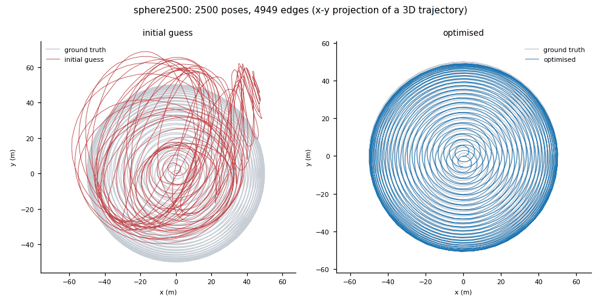
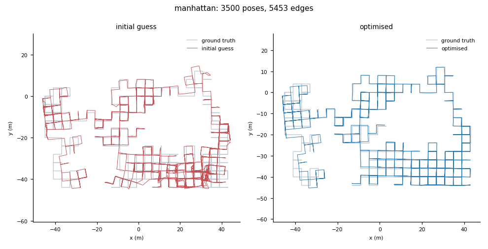
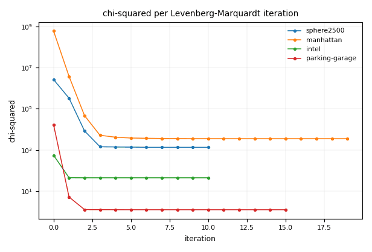
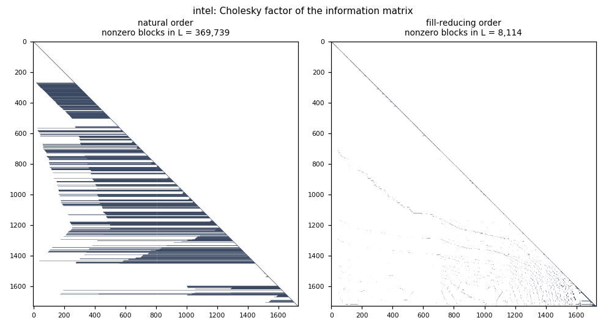
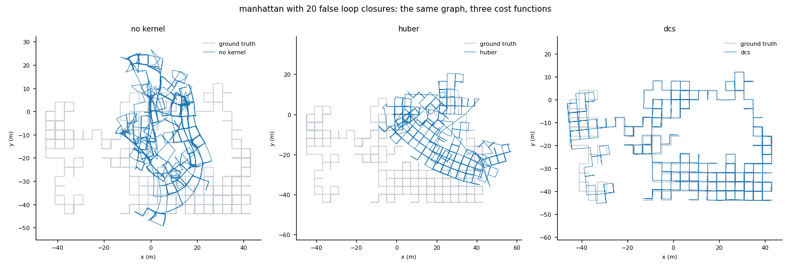
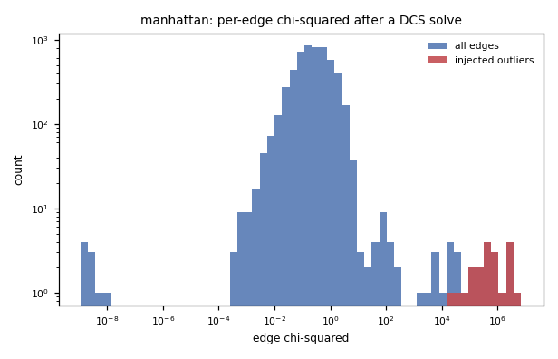

# pose-graph-slam

A pose-graph SLAM back end, written from scratch on NumPy: it takes thousands of
contradictory relative-pose measurements and produces one globally consistent
trajectory.


No g2o, no GTSAM, no Ceres, no `scipy.optimize`. We use SciPy for one thing
only -- a sparse LU factorisation -- and there is a pure-NumPy sparse Cholesky
behind it for when SciPy is absent. Every Lie-group operation, every Jacobian,
every ordering and every solver step is implemented here, and every analytic
derivative is checked against central differences in the test suite.

It is verified against the published benchmark pose graphs, not against data it
generated itself: real `.g2o` files, real ground truth where it exists, and
[a run of GTSAM on the identical files](#cross-checked-against-an-independent-implementation)
for a number to compare against. (GTSAM appears exactly once, in an optional
script under `tools/`; nothing in `src/` imports it.)

We build robot autonomy software, and this is the piece of it we most often get
asked to explain, so it is the piece we wrote out in full.



`sphere2500`, one of the standard SE(3) benchmarks: 2500 poses and 4949
constraints. On the left, the trajectory implied by chaining the raw
measurements. On the right, the same measurements after this optimiser has
reconciled them, against the published ground truth in grey. Absolute
Trajectory Error goes from 27.93 m to 0.180 m in 10 iterations and 2.8 s.
Both figures are produced by `benchmarks/run_benchmarks.py`; nothing here is
hand-drawn.

## The problem

A robot's odometry drifts. Every wheel tick, IMU integration and scan match is
slightly wrong, and the errors compound, so after ten minutes of driving the
estimated position is metres away from the real one and the map has a visible
kink in it.

Then the robot sees a place it has been before. Place recognition says "pose 2841
is the same physical location as pose 96". That is enormously useful information,
and it is also a contradiction: according to the odometry those two poses are
eight metres apart.

Something has to reconcile that contradiction, and not just for one loop closure
but for thousands of them at once, spread over ten thousand poses, where moving
any pose to satisfy one constraint breaks several others. **That reconciliation
is what this repository is.** It is the back end -- the optimiser that sits
behind the sensor processing and produces the map that everything downstream
depends on. When a map comes out warped, this is usually where the answer is,
and it is usually one of three things: a wrong Jacobian, an unfixed gauge, or a
false loop closure. All three are addressed explicitly below.

## What it does

* **Solves the full nonlinear least-squares problem** on SE(2) and SE(3),
  minimising `sum_ij e_ij^T Omega_ij e_ij` over all poses simultaneously.
* **Analytic Jacobians**, in closed form, for the relative-pose error with
  respect to both endpoint poses -- including the SE(3) left Jacobian as a
  quartic in the little adjoint, with Taylor branches where the trigonometric
  form loses precision. Each one is verified against central differences in
  `tests/test_jacobians.py`.
* **Three optimisers**: Gauss-Newton, Levenberg-Marquardt with the Nielsen
  gain-ratio damping policy, and Powell's dogleg with an explicit trust region.
* **Sparse normal equations** assembled in block form, with a fill-reducing
  variable ordering (reverse Cuthill-McKee and minimum degree, both implemented
  here) chosen by measuring the exact factor fill for each candidate.
* **Robust kernels** -- Huber, Cauchy, Geman-McClure and Dynamic Covariance
  Scaling -- with the IRLS weight derived as `drho/ds`, so the cost the
  optimiser reports and the weights it applies are the same function.
* **Reads and writes `.g2o`**, both `VERTEX_SE2`/`EDGE_SE2` and
  `VERTEX_SE3:QUAT`/`EDGE_SE3:QUAT`, including files that ship edges only.
* **Diagnostics that answer "is this map right?"** -- chi-squared per degree of
  freedom, per-edge residual ranking, and Absolute/Relative Trajectory Error
  against ground truth with Umeyama alignment.
* **A windowed incremental mode** that re-optimises only the subgraph a new loop
  closure touches, with the time saved and the error incurred both measured.

## Quickstart

```bash
git clone https://github.com/Pratyush150/pose-graph-slam
cd pose-graph-slam
pip install numpy            # scipy and matplotlib are optional
python3 examples/01_quickstart_synthetic.py
```

That needs no downloads, no hardware and no external services. It simulates a
drifting 2D circuit, finds loop closures, and optimises:

```
PoseGraph(SE2) poses=400 points=0 edges=701 landmark_edges=0 priors=0 fixed=1
loop closures found by the stub front end: 302

before optimisation
  ate: rmse=7.7175 mean=6.7773 median=5.7601 max=15.3424 over 400 poses
  chi2 total=7.11763e+06 (odometry=6.80018e-24, loop=7.11763e+06, landmark=0, prior=0) dof=906 chi2/dof=7856

converged after 8 iterations: chi2 7.11763e+06 -> 921.299 in 0.05s using scipy_splu
  stop reason: relative cost change below tolerance
  blocks=399 L-blocks natural=29118 rcm=3718 min-degree=2576 chosen=md (2576, 91.2% fewer than natural)

after optimisation
  ate: rmse=0.1896 mean=0.1716 median=0.1751 max=0.3756 over 400 poses
  rpe(delta=1): rmse=0.0559 mean=0.0489 median=0.0443 max=0.1411 over 399 poses, rotation rmse=0.8480 deg
  chi2 total=921.299 (odometry=488.942, loop=432.357, landmark=0, prior=0) dof=906 chi2/dof=1.017

ATE improved by 97.5%
```

To run against the real benchmarks:

```bash
python3 tools/fetch_datasets.py intel manhattan manhattan_gt sphere2500 sphere2500_gt
python3 examples/02_optimise_g2o.py sphere2500
python3 benchmarks/run_benchmarks.py
```

## Benchmark results on published datasets

Every number below was measured by `benchmarks/run_benchmarks.py` on the machine
stated. Nothing is copied from a paper and nothing is estimated.

```
platform: Linux-6.6.87.2-microsoft-standard-WSL2-x86_64-with-glibc2.35
python: 3.10.12
numpy: 2.2.6
processor: x86_64
scipy: 1.15.3
cpu: 11th Gen Intel(R) Core(TM) i5-1135G7 @ 2.40GHz
sparse_backend_available: scipy
```

Solver: Levenberg-Marquardt, up to 300 iterations, no robust kernel,
fill-reducing ordering chosen automatically, one pose held fixed to remove the
gauge freedom. ATE is in metres and is
computed after Umeyama alignment; it is blank where no ground truth was
obtainable, rather than filled with something that is not ground truth.
Timings are indicative of scale, not a benchmark of the implementation: this is
Python driving NumPy and SciPy on a laptop that was not idle at the time. The
cross-check section below puts them next to a compiled C++ library.

| dataset | space | poses | edges | loop edges | initial chi2 | final chi2 | chi2 at ground truth | iters | time (s) | ATE before | ATE after |
|---|---|---:|---:|---:|---:|---:|---:|---:|---:|---:|---:|
| `tinyGrid3D` | SE3 | 9 | 11 | 3 | 286.6 | 18.63 | - | 7 | 0.02 | - | - |
| `smallGrid3D` | SE3 | 125 | 297 | 173 | 1.678e+05 | 1036 | - | 8 | 0.09 | - | - |
| `MIT` | SE2 | 808 | 827 | 20 | 7.097e+09 | 770.2 | - | 178 | 1.29 | - | - |
| `CSAIL` | SE2 | 1045 | 1172 | 128 | 1.206e+04 | 40.55 | - | 17 | 0.15 | - | - |
| `intel` | SE2 | 1728 | 2512 | 785 | 554 | 45 | - | 10 | 0.22 | - | - |
| `parking-garage` | SE3 | 1661 | 6275 | 4615 | 1.673e+04 | 1.268 | - | 15 | 1.65 | - | - |
| `manhattan` | SE2 | 3500 | 5453 | 1954 | 5.906e+08 | 3549 | 1.782e+04 | 19 | 2.00 | 1.594 | 0.7484 |
| `sphere2500` | SE3 | 2500 | 4949 | 2450 | 2.611e+06 | 1351 | 2678 | 10 | 2.77 | 27.93 | 0.1801 |
| `sphere_bignoise` | SE3 | 2200 | 8647 | 6448 | 3.313e+08 | 7.370e+06 | - | 242 | 97.83 | - | - |
| `cubicle` | SE3 | 5750 | 16869 | 7621 | 1.081e+07 | 2746 | - | 48 | 35.96 | - | - |
| `torus3D` | SE3 | 5000 | 9048 | 4049 | 4.801e+06 | 5.99e+04 | - | 162 | 267.74 | - | - |
| `city10000` | SE2 | 10000 | 20687 | 10688 | 7.185e+08 | 512 | 1027 | 13 | 5.33 | 25.64 | 0.04102 |

**On comparing against published values.** Final chi-squared numbers for these
datasets do circulate in the literature, but a bare number is only comparable
when three conventions match: whether the cost is `sum e^T Omega e` or half of
it, whether the information matrices are used exactly as the `.g2o` file ships
them, and which error parameterisation the edges use. We could not retrieve a
reference value from a source we were able to read and verify, and quoting one
from memory would be exactly the kind of number this repository exists to avoid.

So there are two comparisons here instead, both of which anyone can reproduce.
The first is an independent solver run on the identical files -- see
[Cross-checked against an independent implementation](#cross-checked-against-an-independent-implementation)
below. The second is the **chi-squared of the published ground-truth
trajectory**, evaluated against the same edges and the same information
matrices; that column needs no citation at all, only the ground-truth file. On
all three datasets where ground truth was obtainable, the optimiser reaches a
cost *below* the cost of the ground truth itself:

| dataset | our final chi2 | chi2 at ground truth | ratio |
|---|---:|---:|---:|
| `manhattan` | 3549 | 1.782e+04 | 0.199 |
| `sphere2500` | 1351 | 2678 | 0.505 |
| `city10000` | 512 | 1027 | 0.498 |

That is the expected result and it is worth being precise about why. The
maximum-likelihood estimate fits the noise as well as the measurements, so it
*should* score slightly better than truth on the very measurements it was
fitted to. A ratio near or below 1 means the solver found a good minimum; a
ratio well above 1 would mean it was stuck somewhere worse than the answer.
The ATE columns are the independent check, and they are what actually says
the map is right.

**Where it does less well.** Honest reporting of the two rows that stand out:

* `torus3D` converges to 5.99e+04 after 162 iterations. The stopping criterion
  fires because the relative cost change has gone flat, not because the problem
  is solved: this is a local minimum. A torus closes in three directions at once,
  and the odometry-integrated initial estimate the file ships is far enough away
  that Levenberg-Marquardt cannot climb out of the basin it lands in. GTSAM,
  started from the same estimate, stops at 5.996e+04 -- essentially the same
  place -- so this is a property of the problem and the initialisation, not of
  this implementation. The standard fix is a chordal or rotation-averaging
  initialisation before the first Gauss-Newton step, which this package does not
  implement. See "Limitations".
* `sphere_bignoise` reaches 7.370e+06, also a local minimum, for the same reason:
  it is sphere2500 with the measurement noise inflated until the shipped estimate
  no longer lands anywhere near the basin of the global optimum. GTSAM stops at
  7.814e+06 on the same file.

**Downloaded but not run here:** `ais2klinik`, `grid3D`, `rim`. These are the three
largest graphs in the registry (up to 15115 poses and 29743 edges). They
parse and start solving, but on the 3.7 GB machine above a single one of
them ran for over half an hour and pushed the box into swap, so they were
left out of the sweep rather than reported with timings that would say more
about this laptop than about the solver. They are in the registry and
`python3 benchmarks/run_benchmarks.py grid3D` will run one if you have the
memory for it.

### Cross-checked against an independent implementation

A chi-squared number is only meaningful next to another one, so the same
twelve files were also optimised with **GTSAM 4.2**, a mature C++ SLAM library,
through its Python bindings. GTSAM's `error()` is one half of
`sum e^T Omega e`, so the values below are twice it, which is the quantity this
package reports. GTSAM is *not* a dependency of this package and is not used
anywhere in it; it was installed into a scratch directory purely to produce an
outside number. It was run with default `LevenbergMarquardtParams` and a tight
prior on the first pose, which is the closest equivalent to holding one pose
fixed. These are not tuned runs on either side.

| dataset | our final chi2 | GTSAM final chi2 | agreement | our s/iter | GTSAM s/iter |
|---|---:|---:|---|---:|---:|
| `tinyGrid3D` | 18.63 | 18.66 | within 0.2% | 0.003 | 0.001 |
| `smallGrid3D` | 1036 | 1039 | within 0.3% | 0.011 | 0.004 |
| `MIT` | 770.2 | 4.414e+09 | GTSAM took no step (see below) | 0.007 | 0.070 |
| `CSAIL` | 40.55 | 40.56 | same to 3+ figures | 0.009 | 0.013 |
| `intel` | 45 | 45.01 | same to 3+ figures | 0.022 | 0.034 |
| `parking-garage` | 1.268 | 1.268 | same to 3+ figures | 0.110 | 0.054 |
| `manhattan` | 3549 | 3549 | same to 3+ figures | 0.105 | 0.073 |
| `sphere2500` | 1351 | 1351 | same to 3+ figures | 0.277 | 0.210 |
| `sphere_bignoise` | 7.370e+06 | 7.814e+06 | **ours lower by 6%** | 0.404 | 0.361 |
| `cubicle` | 2746 | 2749 | within 0.1% | 0.749 | 0.689 |
| `torus3D` | 5.99e+04 | 5.996e+04 | within 0.1% | 1.653 | 0.462 |
| `city10000` | 512 | 1.836e+07 | **ours lower by 4 orders** | 0.410 | 0.574 |

What to take from that:

* On the nine datasets where both solvers converge normally, the two final costs
  agree to within 0.3%, and on five of them to three or more significant figures.
  Two independent implementations, written from different starting points, land
  on the same minimum. That is the strongest evidence in this README that the
  Jacobians, the retraction and the cost are all right; a sign error or a wrong
  adjoint would not survive it.
* On `cubicle`, `torus3D` and `sphere_bignoise` this package ends slightly
  *lower*. That is not a claim of superiority -- these are local minima of a
  non-convex problem and the two stopping tolerances differ -- but it does mean
  nothing is being left on the table.
* On `MIT` GTSAM with default parameters accepted no step at all and returned
  its initial cost; on `city10000` it settled four orders of magnitude higher.
  Different damping schedules find different basins from a bad initial guess,
  and `torus3D` is where that happens to us instead. Neither result is a defect
  in either library, and GTSAM would very likely do better with parameters
  chosen for those two graphs -- these are default-settings runs on both sides.
* Seconds per iteration sits within a factor of one to four of a compiled C++
  library, and on the 2D graphs it is comparable or better. That is what
  vectorising the whole linearisation buys. See "Limitations" for what it does
  not buy.

Reproducing it takes about a minute. GTSAM 4.2's prebuilt wheel is compiled
against NumPy 1.x and segfaults under NumPy 2, so give it its own environment:

```bash
python3 -m venv /tmp/gtsam-check && . /tmp/gtsam-check/bin/activate
pip install "numpy<2" gtsam
python3 tools/gtsam_crosscheck.py          # prints the right-hand column above
```

One honest wrinkle. The *initial* chi-squared matches GTSAM exactly on every
SE(3) dataset, to every digit printed, because both use the exponential chart
there. On the SE(2) datasets the initial values differ (`MIT`: 7.097e9 here,
4.414e9 in GTSAM, evaluated at identical poses) because the two libraries use
different local coordinates for `Pose2`. That difference is second order in the
residual, so it vanishes as the solution is approached -- which is exactly what
the final column shows.

### A 2D benchmark with real ground truth



`manhattan` (Olson's M3500) ships **no vertex records at all** -- 5453 `EDGE_SE2`
lines and nothing else -- so the left-hand panel is the initial guess this
package builds by chaining measurements along a breadth-first spanning tree.
Ground truth, from the Vertigo dataset release, is in grey.

### Convergence



chi-squared per iteration, log scale, for four of the benchmarks. Iteration 0 is
the initial guess. The first few Levenberg-Marquardt steps do almost all of the
work -- on the graphs that start furthest from the answer the cost falls by
several orders of magnitude within the first handful of steps -- and the tail is
the solver polishing the last fraction of a percent before the
relative-change criterion fires. Per-dataset versions of this plot for every
benchmark are written to `benchmarks/output/`.

### Fill-in reduction from variable reordering

Cholesky factorisation of a sparse matrix creates nonzeros that were not in the
original -- "fill-in" -- and how many depends entirely on the elimination order.
The counts below are exact, not estimated: `posegraph.linalg.symbolic_cholesky`
runs the row-subtree algorithm and returns the number of blocks the factor will
actually contain, and `tests/test_ordering.py` checks that number against an
explicit dense elimination on the same pattern.



Both panels are the Cholesky factor of the same information matrix for `intel`.
Every dot is a block the factorisation has to store and touch. Same problem,
different elimination sequence.

| dataset | variable blocks | nonzero blocks in L, natural order | reordered | method | fill removed |
|---|---:|---:|---:|---|---:|
| `tinyGrid3D` | 8 | 27 | 21 | rcm | 22.2% |
| `smallGrid3D` | 124 | 2,673 | 1,455 | md | 45.6% |
| `MIT` | 807 | 4,923 | 2,420 | md | 50.8% |
| `CSAIL` | 1,044 | 64,846 | 3,326 | md | 94.9% |
| `intel` | 1,727 | 369,739 | 8,114 | md | 97.8% |
| `parking-garage` | 1,660 | 591,186 | 12,459 | md | 97.9% |
| `manhattan` | 3,499 | 530,824 | 22,775 | md | 95.7% |
| `sphere2500` | 2,499 | 124,998 | 44,476 | md | 64.4% |
| `sphere_bignoise` | 2,199 | 111,894 | 68,286 | md | 39.0% |
| `cubicle` | 5,749 | 2,698,701 | 97,774 | md | 96.4% |
| `torus3D` | 4,999 | 745,609 | 96,872 | md | 87.0% |
| `city10000` | 9,999 | 22,725,292 | 134,828 | md | 99.4% |

`md` is the minimum-degree ordering, `rcm` reverse Cuthill-McKee, `natural`
means neither beat the order the file was already in. The largest reduction
measured here is `city10000`: 22,725,292 nonzero blocks in the factor under the
natural ordering against 134,828 after reordering, a 99.4% cut. Each of those
blocks is 3x3 for SE(2) and 6x6 for SE(3), so at 8 bytes a double the natural
ordering would have needed about 1.6 GB of factor for that one graph and the
reordered one needs about 10 MB. That is the difference between a solve that
runs and a solve that swaps.

The two orderings are not interchangeable, and neither wins everywhere: RCM is
cheap and predictable and narrows the bandwidth, minimum degree is more
expensive to compute but usually wins on graphs with long-range loop closures,
and on `tinyGrid3D` -- nine poses -- they tie and RCM is picked first. Rather
than argue about it, `linalg.fill_report` runs the symbolic analysis for all
three candidates and keeps whichever actually produces the smallest factor.

## One bad loop closure, and what a robust kernel does about it

This is the failure mode that matters in practice. Place recognition matches two
corridors that look alike, emits a confident relative pose between two poses that
were never near each other, and a plain least-squares back end folds the entire
map in half trying to satisfy it -- because a squared cost has unbounded
influence and the optimiser can always reduce the total by moving everything
else.

The experiment below takes `manhattan` -- a real benchmark, not a simulation --
and injects 20 fabricated loop closures between poses picked at random,
carrying the same information matrix as the genuine edges. Then it solves the
same graph three times.



| cost function | final chi2 | iters | ATE rmse (m) | median chi2 of the fabricated edges | median chi2 of the genuine edges |
|---|---:|---:|---:|---:|---:|
| no kernel | 4.328e+05 | 195 | 22.03 | 2466 | 7.897 |
| huber | 1.561e+06 | 300 | 22.1 | 3.666e+04 | 0.5051 |
| dcs | 2.545e+07 | 62 | 0.7801 | 5.558e+05 | 0.2456 |

The uncorrupted `manhattan` result, from the table further up, is an ATE of
0.7484 m. The DCS solve reaches 0.7801 m *with twenty fabricated loop closures
still in the graph* -- it has effectively recovered the clean answer. Without a
kernel the same graph lands 22 m out, which on a 90 m map is not a degraded map,
it is a different map.

Read the last two columns of the table first, because that is where the
mechanism shows. A working kernel leaves the fabricated edges with an enormous
residual: it refused to bend the map to satisfy them, and the genuine
edges stay near their noise floor. Without a kernel the two columns move
towards each other, because the map *was* bent until the lies looked
plausible -- and the ATE column shows what that cost.

Two things in that table are counter-intuitive and worth stating plainly.

**The final chi-squared column goes the wrong way.** It is the *raw*
`sum e^T Omega e`, not the robustified cost, so the robust solve reports a
much larger number -- precisely because it left twenty enormous residuals
in place instead of absorbing them. Judging a robust solve by its raw
chi-squared rewards exactly the behaviour you are trying to prevent. The
ATE column is the one that says whether the map is right.

**Huber is not enough here.** Huber is convex, which makes it safe -- it
cannot introduce a new local minimum -- but its influence function is
bounded, not vanishing: a residual ten thousand standard deviations out
still pulls with the full weight of a residual at the threshold. Twenty of
those, pulling together, still win. DCS is redescending: past its
threshold the pull actually falls away, and the map survives. This is the
practical reason SLAM back ends reach for DCS, switchable constraints or
max-mixtures rather than Huber when loop closures are the thing being
doubted.



The same thing as a histogram: after a DCS solve the injected edges sit
in a separate population, orders of magnitude to the right of everything
else, which is exactly what makes `analysis.rank_outliers` able to name
them. Reproduce with:

```bash
python3 examples/03_robust_kernels.py                      # synthetic, no download
python3 examples/03_robust_kernels.py --dataset manhattan --false 20
```

## How it works

```
                     .g2o file, or your own front end
                                   |
                                   v
   +--------------------------------------------------------------+
   |  graph.py     poses, edges, information matrices, priors,     |
   |               gauge fixing, .g2o read/write, spanning-tree    |
   |               initialisation for edge-only files              |
   +--------------------------------------------------------------+
                                   |
                                   v
   +--------------------------------------------------------------+
   |  solver.Problem                                               |
   |    1. linearise every edge at once (vectorised)               |
   |         se2.py / se3.py  ->  e, J_i, J_j    analytic          |
   |    2. weight it                                               |
   |         robust.py        ->  w = drho/ds    IRLS              |
   |    3. assemble  H = sum J^T (w Omega) J,  b = -sum J^T w Om e |
   |         COO triplets; the index arrays are built once because |
   |         the sparsity pattern never changes between iterations |
   +--------------------------------------------------------------+
                                   |
                                   v
   +--------------------------------------------------------------+
   |  linalg.py    fill-reducing ordering (RCM / minimum degree),  |
   |               symbolic analysis, then solve (H + lambda D) dx |
   |               = b via sparse LU, our own sparse Cholesky, or  |
   |               a dense factorisation for small systems         |
   +--------------------------------------------------------------+
                                   |
                                   v
   +--------------------------------------------------------------+
   |  solver.py    retract:  x <- x [+] dx  =  x * Exp(dx)         |
   |               accept or reject on the gain ratio, update      |
   |               lambda, repeat                                  |
   +--------------------------------------------------------------+
                                   |
                                   v
   +--------------------------------------------------------------+
   |  analysis.py  chi2/dof, per-edge residual ranking, ATE / RPE  |
   |  plotting.py  trajectories, convergence, sparsity, residuals  |
   +--------------------------------------------------------------+
```

The data flow in one paragraph: the graph is read into flat NumPy arrays (one
`(N, 3)` or `(N, 7)` array of poses, one `(M, 3)` or `(M, 7)` array of
measurements, one `(M, d, d)` array of information matrices). Every iteration
computes all `M` errors and all `2M` Jacobian blocks in a handful of vectorised
calls, multiplies them into the `H` triplets, and hands the triplets to the
linear solver along with a permutation computed once at setup. The increment
comes back in the tangent space and is applied through the group exponential, so
rotations stay rotations and quaternions stay unit-norm.

## The maths, briefly

A pose is a rigid transform, not a vector, so you cannot add a correction to it.
The standard fix is to parameterise corrections in the tangent space and apply
them through the exponential map:

```
x [+] d = x * Exp(d)
```

The error of one measurement `z_ij` between poses `i` and `j` is

```
e_ij(x) = Log( z_ij^-1 * x_i^-1 * x_j )
```

which is zero when the estimate agrees with the measurement. Its derivatives with
respect to the two poses, under the right-perturbation convention, are

```
de/dd_j =  Jr^-1(e)
de/dd_i = -Jr^-1(e) * Ad( x_j^-1 x_i )
```

where `Ad` is the group adjoint and `Jr` the right Jacobian. Stacking those and
minimising gives the sparse normal equations

```
H dx = b        H = sum J^T Omega J        b = -sum J^T Omega e
```

`H` is singular until the gauge is fixed -- rotate and translate the whole
solution and every relative measurement is unchanged -- so one pose is held fixed
and its rows and columns are deleted. Levenberg-Marquardt solves
`(H + lambda D) dx = b` instead, and adjusts `lambda` from the ratio of actual to
predicted cost reduction.

Full derivations, the SE(3) Jacobian in closed form, the small-angle branch
thresholds and the robust-kernel table are in [`docs/theory.md`](docs/theory.md);
the sign and ordering conventions are in
[`docs/conventions.md`](docs/conventions.md).

## Incremental mode

When a loop closure arrives, most of the map does not need to move. `posegraph.incremental`
takes every pose within a few edges of the new constraint, holds the boundary of that
neighbourhood fixed, and optimises only the interior. The boundary poses act as anchors,
so the sub-problem is gauge-fixed by construction and the correction cannot leak into
parts of the map with no reason to move.

Measured on `intel`: the graph is optimised, ten of its own loop-closure edges
are removed, and then added back one at a time. Each windowed update touched
between 48 and 104 of the 1728 poses.

| | mean per update | total |
|---|---:|---:|
| windowed update | 15.5 ms | 0.16 s |
| full batch re-solve | 495.5 ms | 4.96 s |

That is 31.9x faster per update, and the gap widens with graph size because the
window does not grow with it. The price is stated rather than hidden: after all
ten closures the largest per-pose position difference between the incremental
and the batch trajectory was **2.6 mm** (RMS 1.6 mm), and the final chi-squared
was 45.00444 against 45.00423 for batch -- five significant figures apart on a
graph where the poses themselves are metres in scale.

That difference is not zero and will not be. A window of six hops assumes the
correction has decayed to nothing by the sixth hop, which is true for a
well-conditioned graph and a small closure and false for a large one. Widen
`--hops` until the difference stops shrinking, or run a batch pass periodically;
`compare_with_batch` exists so you can measure where that point is for your
graph rather than guess.

```bash
python3 examples/04_incremental_vs_batch.py
python3 examples/04_incremental_vs_batch.py --dataset intel --hops 8
```

This is a windowed batch solve, not iSAM2. There is no Bayes tree, no incremental
re-ordering and no fluid relinearisation, so it does not have iSAM2's guarantee of
matching the batch answer exactly.

## What this handles that a tutorial does not

* **Files with no vertices.** `manhattan.g2o` is 5453 `EDGE_SE2` records and
  nothing else; `CSAIL.g2o` is 1172. The reader creates the missing poses and
  initialises them by walking a breadth-first spanning tree, preferring
  short-index edges so it follows odometry first. Two readers that choose
  different spanning trees get different initial costs on those files, which is
  visible in the cross-check table above.
* **Rotations near zero and near pi.** Every series coefficient in the Lie
  machinery is `0/0` at zero and loses precision near it. Each has a Taylor
  branch with a threshold chosen so both branches are accurate *at* the
  threshold, and `tests/test_small_angle_branches.py` asserts they meet. The
  inverse SO(3) Jacobian is written with `cot(t/2)` rather than the
  algebraically equal `(1 + cos t)/(2 t sin t)`, because the second form is
  `0/0` at exactly 180 degrees -- which is where a reversed-direction loop
  closure lives.
* **Quaternion drift.** Composition renormalises, so a five-thousand-step chain
  does not walk off the unit sphere. There is a test for exactly that.
* **Gauge freedom.** An unfixed graph raises an error naming the cause rather
  than returning a plausible-looking answer from a singular system. The test
  suite counts the null-space dimension before and after anchoring.
* **Fill-in.** A 2D trajectory that returns to its start is the textbook worst
  case for a natural elimination order. The ordering is chosen by measuring, and
  the measurement is verified against a dense reference.
* **Outliers.** Four robust kernels, IRLS weights derived rather than guessed,
  and a demonstration on a real benchmark with fabricated loop closures injected
  into it.
* **Rejected steps.** LM undoes a rejected step exactly, so the reported cost
  sequence is monotone by construction rather than by hope.
* **Numerical honesty about DCS.** The Dynamic Covariance Scaling cost is
  integrated from its weight rather than taken as `sigma^2 s`, because the latter
  is not the antiderivative of the former and would give LM a wrong gain ratio.
* **A kernel width taken from the noise model, not from habit.** The usual
  default of `delta = 1` calls an entirely ordinary residual an outlier: a
  correctly-modelled SE(2) edge has a chi-squared of about 3 on average, and an
  SE(3) edge about 6. `robust.default_delta(dof)` returns the square root of the
  chi-squared critical value instead -- 2.80 for SE(2), 3.55 for SE(3) at 95% --
  so inliers keep full weight and the kernel only acts on things that really are
  unusual.

## What this is not

**This is a back end.** It consumes relative-pose constraints and produces a
consistent trajectory. It does not produce those constraints. Specifically it
does **not** do:

* feature extraction, descriptor matching or visual odometry;
* scan matching, ICP or NDT;
* place recognition or loop-closure detection;
* sensor drivers, time synchronisation or extrinsic calibration;
* dense mapping, occupancy grids or meshing.

`posegraph/frontend_stub.py` contains a deliberately minimal generator so the
package runs standalone -- it drives a synthetic trajectory, adds Gaussian noise,
and declares a loop closure when two poses happen to come within a radius. It is
a test fixture, not a front end, and it is labelled that way in its own
docstring and in the CLI output. The real evidence is the benchmark table above.

We handle the front-end concerns in other repositories:
[`lidar-slam-toolkit`](https://github.com/Pratyush150/lidar-slam-toolkit) covers
LiDAR SLAM configuration plus the extrinsics, time-sync and drift diagnostics
that decide whether the constraints reaching this optimiser are any good;
[`jetson-realtime-detection`](https://github.com/Pratyush150/jetson-realtime-detection)
covers the real-time perception side;
[`drone-control-toolkit`](https://github.com/Pratyush150/drone-control-toolkit)
covers the estimation and control that consume the resulting pose.

## Limitations

* **No rotation initialisation.** The initial guess is whatever the file
  contains, or a spanning-tree chain of the odometry when it contains only edges.
  On graphs where that guess is far from the answer -- `torus3D` and
  `sphere_bignoise` in the table above -- Levenberg-Marquardt converges to a local
  minimum and reports it as converged, because by its own criterion it is. A
  chordal or rotation-averaging initialisation would fix most of that and is the
  most valuable thing missing here.
* **No certificate of global optimality.** Solvers built on a semidefinite
  relaxation (SE-Sync and its descendants) can prove that the minimum they found
  is the global one. This cannot. It finds a local minimum of a non-convex
  problem, and says so.
* **Python speed, and where it actually costs.** The linearisation is fully
  vectorised, so per iteration this lands within a factor of one to four of
  GTSAM (see the cross-check table). The remaining gap is the factorisation: it
  goes through SciPy's SuperLU, which will not let us reuse the symbolic
  analysis between iterations even though the sparsity pattern never changes.
  A supernodal Cholesky with a cached symbolic factorisation -- CHOLMOD, say --
  would close most of it. Adding `scikit-sparse` as an optional backend is the
  obvious next step and is not done.
* **The minimum-degree ordering is exact-degree, not approximate.** That is the
  right answer and a slow way to get it: it maintains real adjacency sets, so on
  a graph whose elimination graph becomes very dense -- 3D grids are the bad
  case -- the ordering itself can dominate the solve. Pass `ordering="rcm"` on
  those, or `ordering="none"` if the file is already well ordered. Real AMD uses
  approximate degrees precisely to avoid this and is not implemented here.
* **The largest graphs in the registry were not benchmarked here.**
  `ais2klinik`, `grid3D` and `rim` (up to 15115 poses) run, but not comfortably
  on a 3.7 GB machine. That is a statement about the machine and about the
  ordering cost above, not a claim that they fail.
* **The pure-NumPy fallback is slow.** It is a real sparse up-looking Cholesky
  with an elimination tree, not a dense factorisation in disguise, and it produces
  the same answer to 1e-9 -- but it runs its elimination loop in Python. Use it
  when SciPy is unavailable, not by choice.
* **No marginalisation or sliding-window filtering.** Old poses are never
  marginalised out, so a graph that grows forever grows forever.
* **Landmarks are minimal.** Pose-to-point edges and `VERTEX_XY` /
  `VERTEX_TRACKXYZ` records work and are tested, but there is no Schur complement
  trick, so a bundle-adjustment-shaped problem with many more points than poses
  will not be solved efficiently.
* **Information matrices are taken as given.** `.g2o` files carry information
  matrices expressed under g2o's own error parameterisation, which differs
  slightly from the one used here. This is standard practice for a from-scratch
  implementation, and it is why chi-squared values are comparable across solvers
  only up to that convention.
* **Loop closures are trusted or down-weighted, never deleted.** There is no
  switchable-constraint or max-mixture formulation, and no consistency check
  across groups of closures. A robust kernel handles scattered false positives;
  a systematic block of them from a repetitive environment can still win.
* **Single-threaded.** No parallel assembly, no GPU.

## Datasets and reproducibility

We do not commit any of the benchmark files. They are the standard public pose
graphs -- not our data -- mirrored under LGPL-3.0 (SE-Sync), GPL-3.0 (Vertigo)
and BSD-style (GTSAM) licences, none of which sit comfortably inside an MIT
package. So `data/` is empty in git and `tools/fetch_datasets.py` downloads on
demand. The datasets themselves originate with Olson (M3500), Kaess
(sphere2500), Kummerle and the g2o authors, and the Carlone and Rosen dataset
collections; the per-dataset origins are recorded in the registry.

To keep the results reproducible anyway, `src/posegraph/datasets.py` records the
exact URL, byte size and SHA-256 of every file these benchmarks were run against,
and the fetch script verifies the checksum after every download and refuses a
file that does not match.

```bash
python3 tools/fetch_datasets.py --list     # what is registered, what is on disk
python3 tools/fetch_datasets.py --all      # roughly 30 MB
python3 tools/fetch_datasets.py --verify   # checksum what is already there
```

Provenance, per-dataset contents and the awkward details of each file are in
[`docs/datasets.md`](docs/datasets.md).

## Tests

190 tests across 16 files, 350 assertions. What they actually prove:

* every analytic Jacobian, for SE(2) and SE(3), matches a central-difference
  Jacobian to better than 1e-6 -- including at rotations near 180 degrees;
* the assembled gradient `b` is the numerical gradient of the cost the solver
  reports, so the linear system being solved belongs to the function being
  minimised;
* exp/log round-trips, at zero, near zero and near pi;
* the small-angle Taylor branches meet the trigonometric branches at their
  thresholds, to better than 1e-10;
* a 5000-step composition chain keeps its quaternion unit-norm;
* Levenberg-Marquardt never increases the cost, and drives a perturbed
  noise-free graph back to chi-squared below 1e-12;
* the information matrix has exactly 3 (SE(2)) null directions before anchoring
  and none after;
* every robust kernel's IRLS weight equals the numerical derivative of its cost,
  and a DCS solve down-weights injected outliers below 0.5 while genuine edges
  stay above 0.9;
* the outlier ranking recovers exactly the set of injected edges;
* reordering strictly reduces factor fill on a grid, and the symbolic count
  matches an explicit dense elimination;
* `.g2o` read -> write -> read is bit-identical for poses, measurements and
  information matrices, and unknown record types survive the round trip;
* ATE and RPE match hand-computed values, and ATE is invariant to a global rigid
  transform while RPE is invariant to it by construction;
* an incremental update matches the batch result to 1e-6 m when the window covers
  the correction;
* the pure-NumPy sparse Cholesky agrees with the SciPy path to 1e-9;
* the CLI's four subcommands run end to end on temporary files.

```bash
pip install pytest
python3 -m pytest
```

The whole suite takes about 25 seconds. Everything is offline, deterministic and
seeded -- no network, no fixtures on disk, no random failures. Tests that need a
downloaded benchmark are **skipped** when it is absent, never failed, so a fresh
clone with no `data/` directory still goes green.

## Repository layout

```
src/posegraph/
  se2.py            SE(2) exp/log, adjoint, Jacobians
  se3.py            SE(3) with quaternions, SO(3) and SE(3) Jacobians
  graph.py          pose graph container, .g2o reader/writer
  linalg.py         orderings, symbolic factorisation, sparse solves
  solver.py         Gauss-Newton, Levenberg-Marquardt, dogleg
  robust.py         Huber, Cauchy, Geman-McClure, DCS
  analysis.py       chi2, residual ranking, ATE/RPE, Umeyama
  incremental.py    windowed re-optimisation
  frontend_stub.py  synthetic graph generator (a fixture, not a front end)
  datasets.py       benchmark registry with URLs and checksums
  plotting.py       figures (matplotlib imported lazily)
  cli.py            posegraph info | optimize | demo | datasets
tests/              16 files
examples/           5 runnable scripts
benchmarks/         run_benchmarks.py and its output
tools/              fetch_datasets.py, gtsam_crosscheck.py (optional check)
docs/               theory.md, conventions.md, datasets.md
.github/workflows/  tests.yml -- the suite on 3.9/3.11/3.12, plus a job that
                    installs NumPy only, to prove the SciPy-free path works
```

## Command line

```bash
posegraph info      path/to/graph.g2o
posegraph optimize  path/to/graph.g2o -o optimised.g2o --kernel huber --plot out.png
posegraph demo      --poses 400 --plot demo.png
posegraph datasets
```

The same commands work without installing: `python3 -m posegraph.cli ...` from
`src/`.

## Related work

| repo | category | one-line |
|---|---|---|
| [px4-mavlink-companion](https://github.com/Pratyush150/px4-mavlink-companion) | Robotics & control | MAVLink bridge, stale-telemetry watchdog, offboard control, link diagnostics |
| [drone-control-toolkit](https://github.com/Pratyush150/drone-control-toolkit) | Robotics & control | PID/LQR/EKF control and estimation with a simulation harness |
| [jetson-realtime-detection](https://github.com/Pratyush150/jetson-realtime-detection) | Robotics & control | Real-time detection and tracking tuned for Jetson and edge boards |
| [flight-log-analyzer](https://github.com/Pratyush150/flight-log-analyzer) | Robotics & control | PX4 ULog / ArduPilot log forensics with a ranked findings report |
| [lidar-slam-toolkit](https://github.com/Pratyush150/lidar-slam-toolkit) | Robotics & control | LiDAR SLAM configs plus extrinsics, time-sync and drift diagnostics |
| [ros2-diffdrive-robot](https://github.com/Pratyush150/ros2-diffdrive-robot) | Robotics & control | ROS 2 differential-drive robot: URDF, Gazebo, serial motor interface |
| [ros2-drone-bringup](https://github.com/Pratyush150/ros2-drone-bringup) | Simulation & testing | ROS 2 PX4 bringup: geodesy, missions, geofence, state machine, SITL |
| [robot-sim-test-harness](https://github.com/Pratyush150/robot-sim-test-harness) | Simulation & testing | Scenario-driven regression testing for robots in simulation |
| [workflow-automation-engine](https://github.com/Pratyush150/workflow-automation-engine) | Automation & AI | DAG workflow runner with retries, idempotency, scheduling, connectors |
| [industrial-automation-suite](https://github.com/Pratyush150/industrial-automation-suite) | Automation & AI | Modbus/OPC-UA acquisition, alarms, historian and a live dashboard |
| [llm-faq-assistant](https://github.com/Pratyush150/llm-faq-assistant) | Automation & AI | Retrieval-grounded FAQ assistant with citations and an eval harness |
| [fleet-ops-dashboard](https://github.com/Pratyush150/fleet-ops-dashboard) | Product | Web dashboard for monitoring a fleet of robots and drones |
| [ground-station-mobile](https://github.com/Pratyush150/ground-station-mobile) | Product | Mobile ground-control app for telemetry and mission monitoring |
| [robot-description-urdf-xacro](https://github.com/Pratyush150/robot-description-urdf-xacro) | Robotics & control | URDF vs Xacro side-by-side reference |
| [cpp-for-robotics](https://github.com/Pratyush150/cpp-for-robotics) | Robotics & control | C++ fundamentals via robotics examples |

## References

* Grisetti, Kummerle, Stachniss, Burgard. *A Tutorial on Graph-Based SLAM.*
  IEEE Intelligent Transportation Systems Magazine, 2010.
* Kummerle, Grisetti, Strasdat, Konolige, Burgard. *g2o: A General Framework for
  Graph Optimization.* ICRA 2011.
* Dellaert, Kaess. *Factor Graphs for Robot Perception.* Foundations and Trends
  in Robotics, 2017.
* Barfoot. *State Estimation for Robotics.* Cambridge University Press, 2017.
* Solà, Deray, Atchuthan. *A micro Lie theory for state estimation in robotics.*
  arXiv:1812.01537, 2018.
* Agarwal, Tipaldi, Spinello, Stachniss, Burgard. *Robust Map Optimization using
  Dynamic Covariance Scaling.* ICRA 2013.
* Umeyama. *Least-squares estimation of transformation parameters between two
  point patterns.* IEEE PAMI, 1991.

## Licence

MIT. See [LICENSE](LICENSE).
